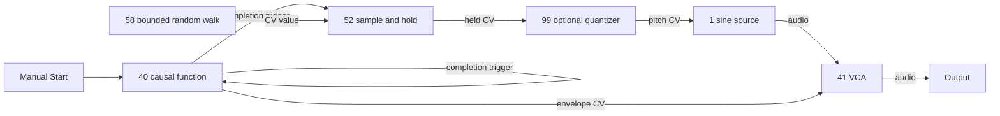

# R1 patch-family coverage — constructive design witnesses

2026-10-05. Covers **16 families**: the original 15 R1-C families plus the user's
research-backed complex/percussive synthesis amendment. See the
[acceptance/source-corroboration record](../plans/R1_ACCEPTANCE_AMENDMENTS.md).
The agent has not directly read the original research. Each witness demonstrates a path through
the [proposed role contracts](R1_FUNCTIONAL_ROLE_REVIEW.md), including control/
event relationships. These are design graphs, **not runnable presets or audio
tests**. No catalogue role is implemented by this pass. Current seven-kind
S1-A graph remains the actual runtime authority.

Numbers refer to catalogue rows; repeated occurrences would be separate instances.
`Output` is infrastructure outside the 100 slots. Mono examples use mono Output;
stereo extensions require an explicit future stereo Output contract. Each cable
must name actual instance/port IDs when authored in R3. Multiple cables into one
ordinary inlet need a summing module; fan-out from one output is transparent.
Knob settings mentioned below are necessary operating conditions, not musical
grading requirements. Unplugged silence remains a valid alternative.

## Minimum coverage matrix

| Family | Required capabilities and catalogue homes | Concrete proposed cable witness | Dependencies / limitations |
|---|---|---|---|
| Subtractive voice | rich periodic source #2; low-pass #11; ADSR #31; gain #41; pitch/gate sequence #76; clock #79 | #79 clock → #76 clock; #76 pitch → #2 pitch; #76 gate → #31 gate; #2 audio → #11 audio → #41 signal → Output; #31 envelope → #41 gain. | Set gain bias zero and ADSR sustain above zero for this articulated example. True ladder character deferred; current graph can approximate only continuous source/filter/VCA. |
| Pad / drone | dual source #6 or cluster #9; slow phase modulation #23; open VCA #41; reverb #61 | #6 a/b audio → #87 a/b → #41 → #61 → Output; #23 phase0 → #41 gain with open bias; phase90 → #6 pitch-b directly using its generic-CV depth mapping. | #6 a/b frequency controls establish beating; small pitch depth adds drift, without a converter or quantizer. Stereo spread via #9/#68 is an optional extension requiring stereo Output. |
| Pluck / LPG | source #1; LPG #13; transient excitation/event #77/#79 | #79 → #77; #77 lane1 trigger → #13 strike; #1 audio → #13 → Output. | Strike produces the advertised LPG decay. Alternative #33 → #41 plus #11 uses separate amplitude/filter envelopes. No pitch sequence required for a repeated pluck. |
| Complex / percussive synthesis | pitched body #1/#8; transient/noise #56; three independent AD envelope instances #33; pitch-depth trim #93; separate gain instances #41; mixer #87 | #79 → #77; lane1 trigger fans freely to #33 pitch/body/noise envelopes and #56. Pitch envelope → #93 → #1 pitch directly as mapped CV; #1 audio → #41 body; #56 audio → #41 noise; body/noise envelopes → their respective gains; both gain outputs → #87 → Output. | Separate pitch/body/noise decays create a struck body and short noisy attack. Optional #8 external FM adds inharmonicity; #56 → #10 adds a resonant branch. These are synthesized elements with no sample kit or obligatory LPG. Positive AD durations, zero gain biases and explicit pitch depth required; event/AD behavior is future scope. |
| Noise texture | continuous colored noise #57; filter #11/#19; slow modulation #21/#58; gain #41; time processing #62 | #57 → #19 → #41 → #62 → Output; #58 → #19 center; #21 → #41 gain. | Center input must declare generic CV-to-frequency mapping. Open gain bias permits breaths rather than only abrupt negative clipping. Delay may be feed-forward; feedback optional. |
| FM / PM | carrier #8; independent audio modulator #1/#6; modulation-depth scaling #93 or #41; index contour #33 | #1 audio → #93 lane1 → #8 linear-fm; #8 audio → Output. Separate PM variant connects that output to #8 phase inlet instead. #33 envelope → #8 index, triggered manually or by #77. | #8 requires real audio-rate linear-FM and phase bindings with separate units. Generic S1-A pitch-CV detune is insufficient. Through-zero FM is not implied. |
| Wavetable | table source #3; independent pitch #76/#99; position modulation #23/#25; scaling #93 | #76 pitch → #3 pitch; #25 a → #93 lane1 → #3 position; #3 audio → Output; #79 → #76. | Valid bundled table assets; separate position and pitch inputs. No fallback ordinary oscillator qualifies as wavetable coverage. |
| Granular | capture/grain processor #64; material #57 or #71; independent modulation #25; optional grain trigger #77 | #57 audio → #64 record input; #25 a → #64 position, b → #64 size; #64 audio → Output. Manual freeze captures the filled buffer. | Require nonzero buffer fill, grain density and size. Freeze affects writes; playback continues. Captured material persistence unresolved until a local resource contract ships. |
| Physical modelling | exciter #56; modal resonator #10 or tuned comb #67; pitch #76; clock #79 | #79 → #76; #76 gate rising edge → #56 trigger; #56 audio → #10 exciter; #76 pitch → #10 pitch; #10 audio → Output. | Explicit gate-edge adapter on the exciter inlet. #10 has no assumed internal strike. Optional comb witness uses #56 → #67 with tuned short-loop feedback/damping. |
| Vocal / formant | rich or breathy material #2/#57; formant bank #16; envelope #31; gain #41; modulation #58 | #2/#57 audio → #87 a/b → #16 → #41 → Output; #58 → #16 vowel; #31 envelope → #41 gain, with manual or sequenced gate. | Covers vowel-like filtering and breath texture, not intelligible speech, vocoding or a vocal sample library. Those are additional gaps if the original research demands them. |
| Evolving modulation network | quadrature #23; chaos #26; signed scaling #93; CV mixer #97; gain-depth control #45/#49; filter #15 | #23 phase0/90 → #97 a/b; #97 → #93 → #15 morph; #26 x → #15 cutoff; #2 audio → #15 → Output. | Acyclic independent sources already evolve. Optional cross-coupled CV loops need positive latency, causal scheduling and declared processor support; not assumed supported by today's graph. |
| Generative sequence | stochastic/chaotic CV #54/#58; sample/hold #52; quantizer #99; probability #55; clock #79; envelope/gain #33/#41 | #58 → #52 sample; #79 clock rising edge → #52 trigger and #55 input; #52 → #99 → #1 pitch; #55 a → #33 trigger; #33 → #41 gain; #1 → #41 → Output. | Explicit clock-edge acceptance on #52/#55. Quantizer can be bypassed; pitch constraint is a chosen tool, not a success condition. #83 adds history/recurrence, not a necessary replacement for this patch. |
| Structured multi-lane sequence | independent lane settings #80; source #2; filter #11; ADSR #31; VCA #41; clock #79 | #79 → #80; pitch lane → #2 pitch; timbre lane → #11 cutoff; gate lane → #31 gate; #31 → #41 gain; #2 → #11 → #41 → Output. | Independent lane lengths/advance ratios and stored patterns must exist. Pitch, timbre and gate cannot simply mirror one scalar sequence. |
| Krell / self-running | causal function/EOC #40; random CV #58; hold #52; optional pitch constraint #99; source #1; gain #41 | Manual Start triggers #40; #40 eoc → its start and #52 sample; #58 → #52 sample-value; #52 → #99 → #1 pitch; #40 envelope → #41 gain; #1 → #41 → Output. | Each contour has strictly positive duration; EOC delivers one causal event. Random duration variation uses #93/#98 into #40 rise/fall with bounds. No global clock or hidden backing sequence required. |
| Tape / microsound | contiguous capture #71; clocked slice reassembly #70; CV speed control #23/#93; clock #79 | #57 audio → #71 record; #71 audio → #70 record → Output; #23 → #93 → #71 speed; #79 clock → #70 advance. | First capture material deliberately. Keep contiguous speed/reverse loop distinct from rearranged slices. #59 can degrade material but cannot substitute for either buffer function. Assets/frozen buffers must survive or be explicitly reported missing. |
| Sample kit | independent sample lanes/assets #84; multi-lane triggers #77; clock #79; per-lane levels #87/#86 or declared kit mix | #79 → #77; lane1–4 triggers → #84 lane1–4; #84 mix → Output. Optional separate audio outputs route to a mixer. | Require four asset mappings and explicit choke/polyphony/retrigger settings. Bundled fictional kit can demonstrate it; no sample import service or cloud dependency implied. Current Rhythm Scratcher has no audio samples/output. |

Pitch inlets directly accept generic CV under their declared mapping, including
the pad's LFO and percussion pitch envelope. Calibrated pitch metadata remains
useful for sequencing and precision sums. Event witnesses use the explicitly
proposed inlet adapters in the role review.

#94's amended pitch/clock bank can optionally replace a plain timing/pitch split
in a multi-voice witness: #76 pitch → #94 pitch, #79 clock → #94 clock; independent
lane pitch outputs → separate oscillator instances and lane clocks → their AD
envelope triggers. Lane transpositions/divisions create contrasting voices while
ordinary direct duplication still costs no rack space. It is optional coverage,
not required hardware or an R2 behavior.

## A causal witness worth checking carefully

The feedback edge is delayed by the envelope duration. Holding the current pitch
between completions creates causality rather than a frame-driven random melody.
The first note uses the declared held initial value; the player starts the loop
deliberately. Set envelope rise/fall to positive values and VCA bias zero for this
example. Audio off must not prevent inspecting or saving its graph. Implementing
these events is later behavior work, not part of R1.

## What coverage does and does not establish

All 16 amended roadmap families have proposed functional homes and explicit witnesses.
Some require settings/assets/adapters or event support yet to be defined precisely.
Current source proves none of the broader module identities' DSP contracts. It
provides continuous oscillator/noise/filter/VCA/LFO/Delay/Output behavior, so only
simple continuous drone, filtered-noise and open-gain patches are currently
available through the visible graph. No claim of an implemented ADSR, LPG, clock,
FM/PM, granulator, sampler or resonator follows from a recovered description.

The manual checks support a few important distinctions: resonator versus exciter,
FM versus pitch modulation, event completion versus clock, stochastic recurrence
versus independent choices, and granular capture versus looping material. The
following are primary references for those distinctions, not replacements for
the project research's full text, whose relevant direction was corroborated by
the user rather than directly inspected by the agent:

- [Rings](https://pichenettes.github.io/mutable-instruments-documentation/modules/rings/manual/): external excitation and resonant material controls.
- [DPO](https://www.makenoisemusic.com/wp-content/uploads/2024/03/dpo-manual.pdf): separate linear/exponential FM inputs and depth.
- [MATHS](https://www.makenoisemusic.com/wp-content/uploads/2024/03/MATHSmanual2013.pdf): function duration and end-of-cycle behavior.
- [Marbles](https://pichenettes.github.io/mutable-instruments-documentation/modules/marbles/manual/): clocked random choices, independent streams and remembered choices.
- [Clouds](https://pichenettes.github.io/mutable-instruments-documentation/modules/clouds/manual/): buffer capture, overlapping grains, density and freeze.
- [Tape & Microsound Music Machine](https://www.makenoisemusic.com/systems/tape-microsound-music-machine/): recording, rearrangement and playback speed/direction.

## Gaps to keep visible at review

- User-supplied corroboration closes the general bible/research direction gap and
  identifies percussion as an additional family. Exact historical metadata and
  any further unquoted research requirements remain annotated; another broad
  research pass is not a prerequisite for the seven-behavior seam.
- Vocal/formant means vowel-like timbre; speech/vocoder capability has no accepted home.
- #100 intentionally has no coverage role. Output/master safety is infrastructure,
  never an acquisition gate. Input capture/import is also not assumed implemented.
- Latency/rate, control ranges, exact lane counts, sample storage and stereo Output
  require later scoped implementation choices. They are not evidence of a working patch.
- Rack capacity should follow actual starter patches plus useful new relationships.
  These witnesses provide candidates to measure, not a new fixed capacity number.
- Several processors can serve multiple identities. No implication that all 100
  must ship before a playable chapter or that serious DSP precedes game completion.

R1/R1A were subsequently accepted and closed, and the separately authorized
[R2 seam is implemented and validated](../project/R2_DATA_DRIVEN_PATCH_SEAM.md).
It contains only the seven existing behaviors and preset/archive preservation
fixtures, without the capability/event/resource frameworks described for later phases.
Starter presets remain R3;
broader crude capabilities remain R5 and serious DSP remains R9.
